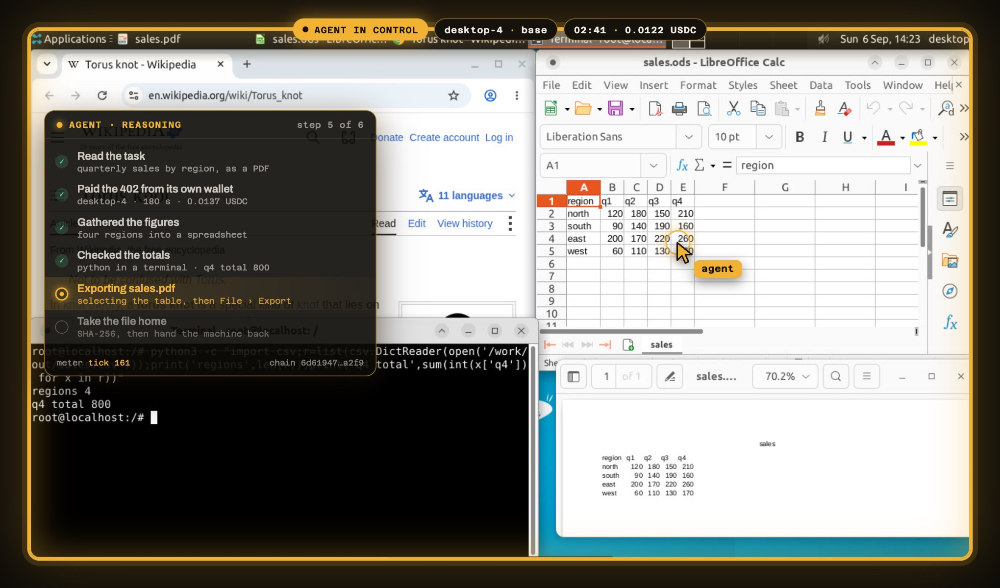
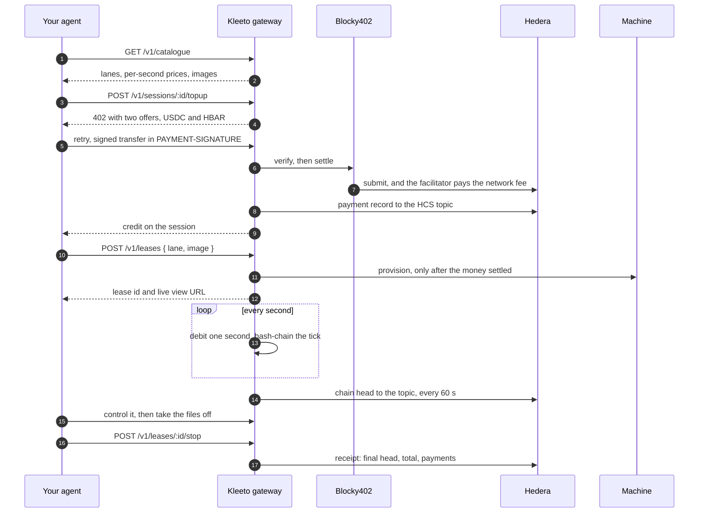

<div align="center">


# Kleeto

**Computers for AI agents. Rented by the second, paid from the agent's own wallet,
over [x402](https://x402.org) on [Hedera](https://hedera.com).**

[](./LICENSE)
[](https://docs.x402.org)
[](https://hashscan.io/testnet)
[](https://nodejs.org)

**[kleeto.fun](https://kleeto.fun)** — watch an agent rent one, live

</div>



Agents can work for hours now. They still have no computer of their own. When a job needs a real
browser session, a desktop application with no API, or a clean machine to run code on, the agent
borrows yours: your screen, your logins, your laptop left open until it finishes.

Kleeto rents it one instead. A browser, a headless Linux machine, or a full desktop with the
applications already installed. There is no account to make, no API key and no card. The agent
asks for a machine, gets back `402 Payment Required` with a per-second price, and pays it from a
Hedera wallet you gave it, in USDC or HBAR. You get a link to watch it work. When it is done the
machine goes back and the files come to you, each with its SHA-256.

## Install it into your agent

Kleeto ships as a skill: instructions plus a small CLI that Claude Code, Codex, Cursor and other
agents load when a task needs a computer.

```sh
npx skills add akash-mondal/kleeto-skill
```

Give the agent a wallet to spend from by setting `KLEETO_ACCOUNT_ID` and `KLEETO_PRIVATE_KEY`.
A free testnet account from [portal.hedera.com](https://portal.hedera.com) is enough. That is the
whole setup. After that the agent reads the catalogue itself, says what it wants to rent and what
it will cost, and waits for your yes before it pays.

```sh
node scripts/kleeto.mjs discover                              # lanes, prices, desktop images
node scripts/kleeto.mjs topup --lane desktop-4 --seconds 180  # answers the 402 from your wallet
node scripts/kleeto.mjs rent  --lane desktop-4 --image base   # lease id and a live view link
node scripts/kleeto.mjs do <leaseId> screenshot               # then open, click, type, exec
node scripts/kleeto.mjs pull <leaseId> /work/out/report.pdf ./report.pdf
node scripts/kleeto.mjs return <leaseId>                      # the meter stops
```

## What it rents

| Lane | What it is | $ / hour |
|---|---|---:|
| `browser-fast` | Real Chrome over CDP. Reads and fills in the web | 0.110 |
| `browser-max` | Stealth Chromium, residential egress, CAPTCHA solving, for sites that block bots | 1.633 |
| `machine-1` … `machine-8` | Headless Linux, 1 to 8 vCPU: shell, files, builds, renders | 0.063 – 0.502 |
| `desktop-2` | Full Linux desktop, 2 vCPU, 1280×720, mouse and keyboard, live view | 0.147 |
| `desktop-4` | The same at 4 vCPU and 1920×1080 | 0.273 |

Desktops boot from an image: `base` (LibreOffice, GIMP, Inkscape, Chrome), `studio` (Blender,
darktable, Scribus, Kdenlive), `engineering` (KiCad, FreeCAD, QGIS) or `office` (DBeaver,
Thunderbird, GnuCash, Remmina, Wireshark). The lane sets the price; the image is free. Prices are
set in dollars and quoted per second in tinybar at the ledger's own rate, so the USDC and HBAR
offers in a 402 are always worth the same. Live numbers are at `GET /v1/lanes`.

## One job, on the ledger

One prompt, on testnet: research the best-selling products on a marketplace that blocks bots,
design a better version, render a product shot, and deliver a one-page spec sheet with a price
comparison. The agent, GPT-6 Astra through Codex, asked what it needed to know, proposed a plan
with a price, waited for a yes, then used five machines and paid for each of them itself.

| # | What it did | Paid | Proof |
|---|---|---:|---|
| 1 | Opened the marketplace on `browser-fast`. Blocked, so it handed the browser straight back | 0.0055 USDC | [HashScan](https://hashscan.io/testnet/transaction/0.0.7162784-1789134582-137739105) |
| 2 | Escalated to `browser-max` and got past the bot wall | 0.0817 USDC | [HashScan](https://hashscan.io/testnet/transaction/0.0.7162784-1789134629-196804413) |
| 3 | Topped that same browser up mid-lease instead of starting over | 0.0817 USDC | [HashScan](https://hashscan.io/testnet/transaction/0.0.7162784-1789134794-963904561) |
| 4 | Took `desktop-4` on `engineering` and designed the part in CAD | 0.0136 USDC | [HashScan](https://hashscan.io/testnet/transaction/0.0.7162784-1789134826-675675371) |
| 5 | Took `desktop-4` on `studio` and built the 3D scene | 0.0136 USDC | [HashScan](https://hashscan.io/testnet/transaction/0.0.7162784-1789135048-633834405) |
| 6 | Rented a `machine-8` beside it for the render | 0.0256 USDC | [HashScan](https://hashscan.io/testnet/transaction/0.0.7162784-1789135819-364538460) |
| 7 | Topped the desktop up, laid out the spec sheet, pulled the PDF off | 0.0139 USDC | [HashScan](https://hashscan.io/testnet/transaction/0.0.7162784-1789136263-088772439) |

Five machines, three kinds, **0.2357 USDC**, six files home with their hashes.

Every one of those is a USDC transfer from the agent's own account
[`0.0.10454764`](https://hashscan.io/testnet/account/0.0.10454764) to the gateway
[`0.0.7284970`](https://hashscan.io/testnet/account/0.0.7284970). Check the fee line on any of
them: the network fee, about 0.0149 ℏ, came from the facilitator
[`0.0.7162784`](https://hashscan.io/testnet/account/0.0.7162784), so the agent's balance moved by
exactly the price. The seconds each machine ran, and the receipt closing it out, are on topic
[`0.0.10454763`](https://hashscan.io/testnet/topic/0.0.10454763).

## How a rental works



The gateway is one HTTP surface: catalogue, 402s, leases, controls, live view and files. Payment
is x402 v2, `exact` scheme, settled through [Blocky402](https://blocky402.com); the fee payer is
read from its `/supported` at boot, never hardcoded. Machines come from upstream providers, and
nothing is provisioned until the payment has settled. The live view is served from Kleeto's own
origin, so the supplier's endpoint never reaches a browser.

## The meter

`exact` pays once for one thing. Kleeto sells seconds, which keep arriving. Settling every second
would be thousands of transactions an hour on a ledger slower than the tick, and prepaying a
block just makes the agent guess. So the agent pays into a balance and the meter draws it down.

- **A session holds the credit.** One agent, one balance, any number of leases, in tinybar.
- **Every second is a tick, chained to the one before.**
  `sha256(prev | seq | leaseId | tinybar | at)`, from a genesis that binds the lease, the lane,
  the agreed price and the start time. Change any second and every hash after it moves.
- **Running low is an event, not an ending.** Under a minute left, the meter says so.
- **Running out pauses the machine** and keeps its files and processes. The next top-up resumes it.
- **Every payment, a head each minute, and a closing receipt** go to HCS topic
  [`0.0.10454763`](https://hashscan.io/testnet/topic/0.0.10454763). A head proves every second
  beneath it, which is why it is one message a minute and not one a second.

`GET /v1/leases/:id/meter` streams the same thing as server-sent events: `tick`, `low`, `paid`,
`exhausted`, `anchor`, `anchored`.

## Checking a bill yourself

`GET /v1/leases/:id/proof` gives every second with its hash, the payments that funded it, and
where each record landed. This is a lease the live demo agent rented, paid for and returned:

```json
{
  "leaseId": "ls_IqOn8TiBuBvI", "lane": "machine-1", "rateTinybar": 23309,
  "seconds": 21, "totalTinybar": 489489, "selfCheck": { "ok": true },
  "hcsTopic": "0.0.10454763",
  "howToVerify": "sha256(prev|seq|leaseId|tinybar|at) for each tick, starting from genesis",
  "payments": [{ "tinybar": 4195620, "asset": "USDC", "transaction": "0.0.7162784@1789153547.123279951",
                 "audit": { "topicSequence": 8, "transaction": "0.0.7284970@1789153555.918576967" } }],
  "anchors":  [{ "seq": 21, "head": "227c4a19d310c70e…", "final": true, "topicSequence": 9 }]
}
```

The [receipt](https://hashscan.io/testnet/transaction/0.0.7284970-1789153581-771917719) for that
lease, as the ledger holds it:

```json
{"t":"kleeto/receipt","v":1,"lease":"ls_IqOn8TiBuBvI","lane":"machine-1","rate":23309,"seq":21,
 "head":"227c4a19d310c70ea46cbe4ea3982ac61e26a03ab788d82a62c2cbcbdf8ec661",
 "total":489489,"payments":["0.0.7162784@1789153547.123279951"]}
```

Recompute it yourself, without asking Kleeto for anything:

```js
const proof = await (await fetch(`https://api.kleeto.fun/v1/leases/${leaseId}/proof`)).json();
let prev = proof.genesis, heads = new Map();
for (const t of proof.ticks) heads.set(t.seq, prev = sha256(`${prev}|${t.seq}|${proof.leaseId}|${t.tinybar}|${t.at}`));

// then read the topic from the public mirror node and compare each head:
// https://testnet.mirrornode.hedera.com/api/v1/topics/0.0.10454763/messages
// rate × seconds is the bill: 23309 × 21 = 489,489 tinybar
```

## Why Hedera

- **The agent pays no network fees.** In the `exact` scheme the facilitator signs as fee payer.
  On payment 1 above: agent `-5,501` USDC units, gateway `+5,501`, facilitator `-1,490,090`
  tinybar for the fee. An agent can hold only the money it means to spend, with no second gas
  balance to keep alive.
- **Both currencies are native.** USDC is a Hedera Token Service asset, HBAR is the network's own,
  and every 402 offers both.
- **The price comes from the ledger**, via the mirror node's `/network/exchangerate`. No
  third-party feed to trust or go stale.
- **The record sits where Kleeto can't edit it.** The HCS topic's submit key is the gateway's, but
  consensus orders and timestamps every message and the mirror node serves them to anyone, free.
- **Mainnet is a flag.** Every network-specific id lives in one table in `src/networks.mjs`, and
  `npm run net` resolves both networks today.

## Finding Kleeto, and knowing who it is

An agent that has never heard of Kleeto can find it and check who it is about to pay.

- **A2A**: an agent card at
  [`/.well-known/agent-card.json`](https://api.kleeto.fun/.well-known/agent-card.json) and a
  JSON-RPC endpoint at `/a2a` that answers `SendMessage` with prices and how to pay.
- **x402 discovery**: [`/discovery/resources`](https://api.kleeto.fun/discovery/resources) and
  [`/.well-known/x402`](https://api.kleeto.fun/.well-known/x402) list every paid resource with its
  v2 payment requirements, so a client can budget before it sees a 402.
- **Identity on the ledger**: both accounts carry an HCS-14 Universal Agent ID inside an HCS-11
  profile, inscribed on an HCS-1 topic that the account memo points at. `npm run identity` writes
  them; any HCS-11 resolver reads them back.

| Agent | Account | Profile | Universal Agent ID |
|---|---|---|---|
| Gateway | [`0.0.7284970`](https://hashscan.io/testnet/account/0.0.7284970) | [`hcs://1/0.0.10482737`](https://hashscan.io/testnet/topic/0.0.10482737) | `uaid:aid:69HXbXcW…;proto=a2a;nativeId=hedera:testnet:0.0.7284970` |
| Demo agent | [`0.0.10454764`](https://hashscan.io/testnet/account/0.0.10454764) | [`hcs://1/0.0.10482740`](https://hashscan.io/testnet/topic/0.0.10482740) | `uaid:aid:3QpuULhR…;proto=mcp;nativeId=hedera:testnet:0.0.10454764` |

## The live demo

[kleeto.fun/demo](https://kleeto.fun/demo) runs the whole thing without you bringing an agent.
Describe a task, pick a model (GPT-6 Astra through Codex, or GLM-5.3-Flash, Kimi K3 or
MiniMax-M3 through Cline), and a hosted agent with its own wallet pays the same 402s yours would.
It asks what it needs, prices a plan, and waits for a yes before spending. Then you watch the
desktop, the meter and the payments move together, and download what it made. Two runs go at a
time; everyone else waits in a queue they can see.

## Run it yourself

Node 22+, a Hedera testnet account, a [Solari](https://getsolari.com) key for machines and
desktops, and a [browser-use](https://browser-use.com) key for `browser-max`.

```sh
git clone https://github.com/akash-mondal/kleeto && cd kleeto
npm install
cp .env.example .env         # operator account, provider keys

npm run bootstrap            # HCS topic + a funded test agent, into var/hedera.json
npm run associate-usdc       # lets the gateway be paid in USDC
npm run images               # builds the desktop images
npm run identity             # HCS-14 ids and HCS-11 profiles for both accounts
npm run gateway              # http://localhost:8787
```

Put the topic id from `bootstrap` into `HCS_TOPIC_ID`, then, against the running gateway:

```sh
npm run net                  # both networks resolve: fee payer, HBAR rate, USDC token
npm run pay                  # a real x402 top-up, a lease, the meter, the proof
npm run test:meter           # the metered path over HTTP (needs KLEETO_DEV_CREDIT=1)
cd landing && npm install && npm run dev     # the site and the demo UI on :3000
```

The hosted demo adds `npm run worker` on a machine with Codex or Cline installed;
`deploy/azure-vm.sh` and `deploy/codex-host.sh` build that machine. Every variable is described in
[`.env.example`](./.env.example).

## API

Base URL `https://api.kleeto.fun`. The two routes marked 402 are where money moves.

| | Method | Path | What it does |
|---|---|---|---|
| **Discover** | `GET` | `/.well-known/agent-card.json` · `/discovery/resources` | the A2A card, and every paid resource with its payment requirements |
| | `POST` | `/a2a` | A2A JSON-RPC: `SendMessage` answers with the catalogue and how to pay |
| **Choose** | `GET` | `/v1/catalogue` | lanes, prices, images, and what each kind of machine can do |
| **Pay** | `POST` | `/v1/sessions` · `/v1/sessions/:id/topup` | open a session; **402** to credit it, in USDC or HBAR |
| | `GET` | `/v1/sessions/:id` | balance, burn rate, seconds remaining, top-ups |
| **Rent** | `POST` | `/v1/leases` | **402** unless the session is funded: a browser, machine or desktop |
| | `POST` | `/v1/leases/:id/control` | drive it: open, click, type, press, scroll, exec, read, write |
| | `POST` | `/v1/leases/:id/deliver` | take a file off the machine, recorded with its SHA-256 |
| | `POST` | `/v1/leases/:id/stop` | hand it back; the receipt is published |
| **Verify** | `GET` | `/v1/leases/:id/meter` · `/v1/leases/:id/proof` | the meter as SSE; every second, its hash and its records on the topic |
| **Watch** | `GET` | `/live/:token` | the live view |
| **Demo** | `POST` | `/v1/jobs` | queue a task for a hosted agent, then `/v1/jobs/:id/stream` |

## Layout

```
src/gateway/   server.mjs  the HTTP API           x402.mjs   the two-asset 402, verify, settle
               meter.mjs   sessions, the hash chain, proofs
               hcs.mjs     payments, heads and receipts on the topic
               live.mjs    the live view      control.mjs   driving a machine
               deliverables.mjs  files off the machine, hashed
               jobs.mjs    the demo queue
src/           lanes · images · networks · identity · adapters (providers) · mcp · worker
scripts/       ledger setup, image builds, end-to-end checks
deploy/        the VM and headless agent host behind the demo
landing/       kleeto.fun: the site and the demo UI (Next.js)
```
