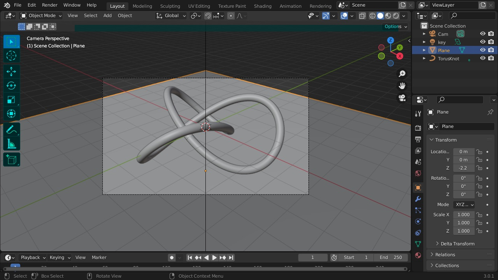
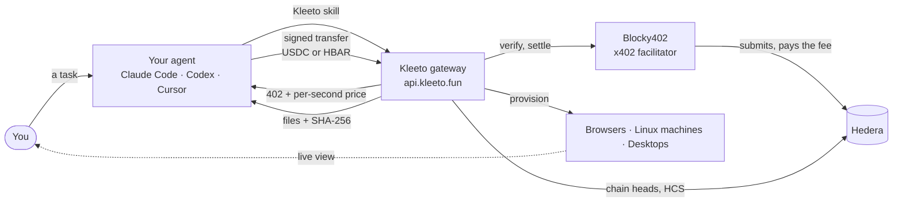
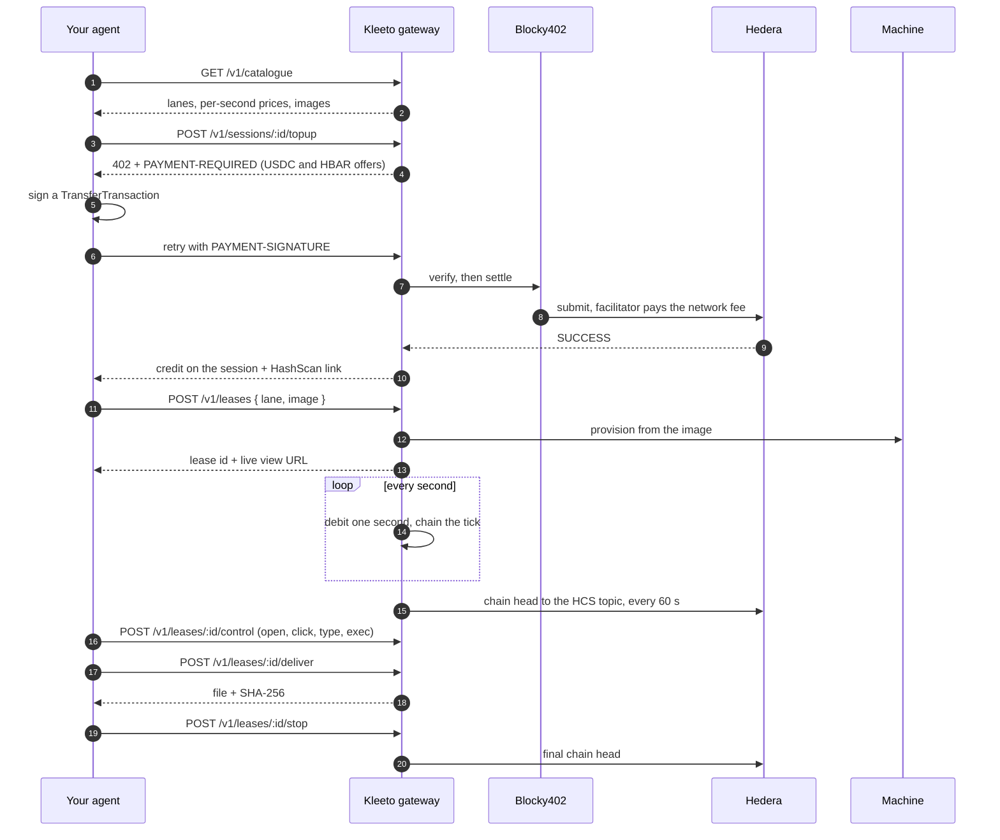
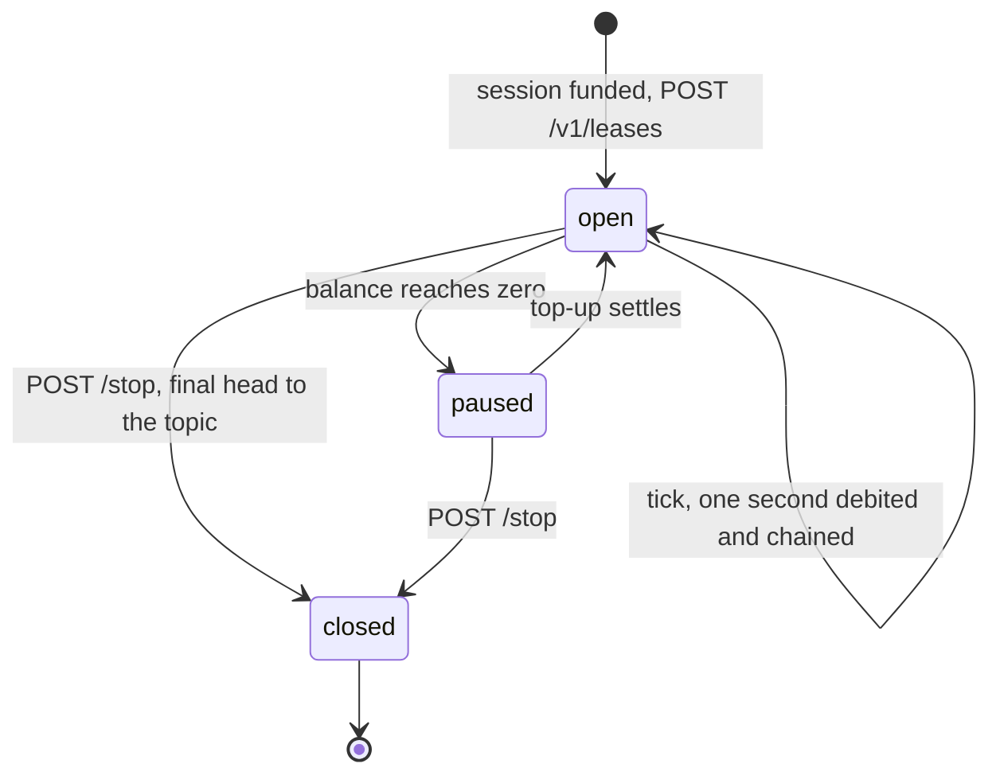
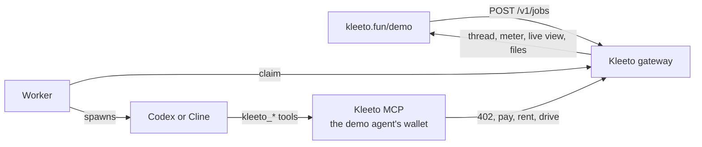

<div align="center">


# Kleeto

**Computers for AI agents. Rented by the second, paid from the agent's own wallet,
over [x402](https://x402.org) on [Hedera](https://hedera.com).**

[](./LICENSE)
[](https://docs.x402.org)
[](https://hashscan.io/testnet)
[](https://nodejs.org)

**[kleeto.fun](https://kleeto.fun)**: watch an agent rent one, live

```sh
npx skills add akash-mondal/kleeto-skill
```

</div>



Agents can carry a task for hours now. What they still don't have is a computer. Ask one to
model a part in FreeCAD, get past a site that blocks bots, or render a scene in Blender, and it
borrows yours: your screen, your logins, your laptop left open until it's done.

**Kleeto is where an agent rents its own.** A real browser, a clean Linux machine, or a full
desktop with the applications already installed, up in seconds. There is no account to create,
no API key to paste and no card on file. The agent asks for a machine, Kleeto answers
`402 Payment Required` with a per-second price, and the agent pays it from a Hedera wallet you
gave it, in USDC or HBAR. You get a link to watch it work. When the job is done it hands the
machine back, and everything it made comes home with a SHA-256 beside it.

It works with the agent you already use. One command installs Kleeto as a skill into Claude
Code, Codex, Cursor, or any agent that reads skills:

```sh
node scripts/kleeto.mjs discover                                   # lanes, prices, desktop images
node scripts/kleeto.mjs topup --lane desktop-4 --seconds 180       # 402 -> sign -> settle, from your wallet
node scripts/kleeto.mjs rent --lane desktop-4 --image studio       # Blender, Scribus, darktable, Kdenlive
node scripts/kleeto.mjs do <leaseId> open --app blender            # click, type, exec, screenshot...
node scripts/kleeto.mjs pull <leaseId> /work/out/render.png ./render.png
node scripts/kleeto.mjs return <leaseId>                           # the meter stops
```

---

## Contents

- [What an agent can rent](#what-an-agent-can-rent)
- [One job, start to finish](#one-job-start-to-finish)
- [How it works](#how-it-works)
- [Renting a computer, on the wire](#renting-a-computer-on-the-wire)
- [Why Hedera](#why-hedera)
- [The meter](#the-meter)
- [Checking a bill yourself](#checking-a-bill-yourself)
- [The live demo](#the-live-demo)
- [Run it yourself](#run-it-yourself)
- [API](#api)
- [Repository layout](#repository-layout)
- [Status and known limits](#status-and-known-limits)

---

## What an agent can rent

Three kinds of computer, eight sizes. Nobody tells the agent which one to take: it reads the
catalogue, picks the smallest thing that can do the job, and escalates when it has to.

| Lane | What it is | $ / hour |
|---|---|---:|
| `browser-fast` | A real Chrome driven over CDP. Reads and fills in the web | 0.110 |
| `browser-max` | Stealth Chromium, residential egress, automatic CAPTCHA solving, for sites that block bots | 1.633 |
| `machine-1` … `machine-8` | A headless Linux machine, 1 to 8 vCPU: shell, files, builds, renders | 0.063 – 0.502 |
| `desktop-2` | A full Linux desktop, 2 vCPU, 1280×720, mouse and keyboard, live view | 0.147 |
| `desktop-4` | The same at 4 vCPU and 1920×1080 | 0.273 |

A desktop boots from one of four images. The image is what is installed, the lane is how much
machine, and only the lane costs anything.

| Image | For | Applications |
|---|---|---|
| `base` | documents, bitmap and vector work, the web | LibreOffice, GIMP, Inkscape, Chrome |
| `studio` | 3D, photography, print, video | Blender, darktable, Scribus, Kdenlive |
| `engineering` | electronics, CAD, geospatial | KiCad, FreeCAD, QGIS |
| `office` | databases, mail, bookkeeping, remote access, network forensics | DBeaver, Thunderbird, GnuCash, Remmina, Wireshark |

Prices are set in dollars and quoted per second in tinybar against the ledger's own HBAR rate,
so the USDC and HBAR offers in a 402 are always worth the same. `GET /v1/lanes` has the live
numbers.

---

## One job, start to finish

The run recorded for the demo, on testnet. One prompt to one agent:

> I sell 3D-printed cable organizers on Etsy. Check the top 5 best-selling cable organizers
> there (price, rating, reviews). Then design my new version in FreeCAD with five slots for
> USB-C cables, render a clean product shot in Blender, and make a one-page spec sheet PDF with
> the render and a price comparison table. Send me the STL too.

The agent (GPT-6 Astra through Codex) asked what it needed to know, proposed a plan with a
price, waited for a yes, and then did this. Every payment is a USDC transfer from the agent's own account
[`0.0.10454764`](https://hashscan.io/testnet/account/0.0.10454764) to the gateway
[`0.0.7284970`](https://hashscan.io/testnet/account/0.0.7284970). Open any of them.

| # | What happened | Paid | On Hedera |
|---|---|---:|---|
| 1 | Buys credit for a browser and opens Etsy on `browser-fast`. Etsy blocks it, so it hands the browser back | 0.005501 USDC | [CRYPTOTRANSFER](https://hashscan.io/testnet/transaction/0.0.7162784-1789134582-137739105) |
| 2 | Escalates to `browser-max`, gets past the bot wall and reads the best-selling listings | 0.081667 USDC | [CRYPTOTRANSFER](https://hashscan.io/testnet/transaction/0.0.7162784-1789134629-196804413) |
| 3 | Tops the same stealth browser up mid-lease instead of starting over, finishes, hands it back | 0.081667 USDC | [CRYPTOTRANSFER](https://hashscan.io/testnet/transaction/0.0.7162784-1789134794-963904561) |
| 4 | Rents `desktop-4` on the `engineering` image and models the organizer in FreeCAD. Takes the STL and the `.FCStd` off, hands it back | 0.013641 USDC | [CRYPTOTRANSFER](https://hashscan.io/testnet/transaction/0.0.7162784-1789134826-675675371) |
| 5 | Rents `desktop-4` on `studio` and builds the product scene in Blender | 0.013641 USDC | [CRYPTOTRANSFER](https://hashscan.io/testnet/transaction/0.0.7162784-1789135048-633834405) |
| 6 | Rents a `machine-8` beside it for the render, takes the PNG off, hands it back | 0.025611 USDC | [CRYPTOTRANSFER](https://hashscan.io/testnet/transaction/0.0.7162784-1789135819-364538460) |
| 7 | Tops the studio desktop up, lays the spec sheet out in Scribus, takes the PDF off, hands it back | 0.013929 USDC | [CRYPTOTRANSFER](https://hashscan.io/testnet/transaction/0.0.7162784-1789136263-088772439) |

**Five machines, three kinds, 0.2357 USDC.** Six files came home, each recorded with its hash:
`FIVE-120.stl`, `FIVE-120.FreeCAD.FCStd`, `FIVE-120.blend`, `FIVE-120-product.png`,
`FIVE-120-spec.pdf` and `FIVE-120-Etsy-comparison.csv`.

Look at the fee line on any of those transactions. The network fee, about 0.0149 ℏ each time,
was paid by [`0.0.7162784`](https://hashscan.io/testnet/account/0.0.7162784), the facilitator.
The agent's balance moved by exactly the price and not a tinybar more.

---

## How it works



- **The gateway** is one HTTP surface: the catalogue, the 402s, the leases, the controls, the
  live view and the files. Nothing it returns names or links a supplier.
- **Payment** is x402 v2, `exact` scheme, on `hedera:testnet`, settled by
  [Blocky402](https://blocky402.com). Every 402 carries two offers, USDC and HBAR, and the
  facilitator's fee payer is read from its `/supported` at boot rather than hardcoded.
- **The machines** come from upstream providers. A lease is provisioned only after payment has
  settled, so a plausible-looking header never buys a free computer.
- **The live view** is Kleeto's own page on Kleeto's own origin, relaying frames over its own
  socket. The upstream endpoint is resolved server-side and never reaches a browser.
- **The meter** debits the session once a second, hash-chains every tick, and publishes the
  chain head to a Hedera Consensus Service topic. More [below](#the-meter).
- **Files** the agent takes off a machine are recorded with their size and SHA-256 before it is
  handed back, so what reaches you is what the machine produced.

---

## Renting a computer, on the wire



---

## Why Hedera

**The agent pays no network fees.** In Hedera's `exact` scheme the facilitator signs as fee
payer. From payment 1 of the job above:

| Account | Change | |
|---|---:|---|
| agent `0.0.10454764` | `-5,501` USDC units | exactly the price |
| gateway `0.0.7284970` | `+5,501` USDC units | |
| facilitator `0.0.7162784` | `-1,490,090` tinybar | the whole network fee |

An agent can hold only the money it means to spend. There is no second gas balance that runs dry
for reasons that have nothing to do with the work.

**Both currencies are native.** USDC is a Hedera token service asset and HBAR is the network's
own, so every 402 offers both and the agent pays in whichever it holds.

**The price comes from the ledger.** The HBAR rate is the mirror node's own
`/network/exchangerate`. There is no third-party price feed to trust or to go stale.

**The record of the seconds lives somewhere Kleeto can't edit.** Chain heads go to a
Consensus Service topic whose submit key only the gateway holds. Consensus orders and
timestamps each message, and the public mirror node serves them to anyone, free, with no key.

**Mainnet is a flag.** Every network-specific id (mirror, facilitator, USDC token, explorer)
lives in one table in `src/networks.mjs`. `npm run net` resolves both networks today.

---

## The meter

x402's `exact` scheme pays once for one thing. Kleeto sells seconds, which never stop arriving.
A settlement every second would be thousands of transactions an hour on a ledger whose finality
is slower than the tick, and prepaying a fixed block means the agent guesses how long the job
takes. So the agent pays into a balance and the meter draws it down one second at a time.

- **A session holds the credit.** One agent, one balance, any number of leases. Credit is in
  tinybar, the unit that actually settled.
- **Every second is a tick, chained to the one before it.**
  `hash = sha256(prev | seq | leaseId | tinybar | at)`, starting from a genesis that binds the
  lease, the lane, the price it agreed to and its start time. Change any second and every hash
  after it moves.
- **Running low is an event, not an ending.** Under a minute of credit left, the meter says so
  and the agent tops up.
- **Running out pauses the machine and keeps its state.** The next top-up resumes it with its
  files and processes intact.
- **The chain head is published.** Every 60 seconds, and once more when the lease is handed
  back, the head goes to the topic. One message a minute instead of one a second, because a head
  proves every second beneath it.



`GET /v1/leases/:id/meter` streams it as server-sent events:

| Event | When | Carries |
|---|---|---|
| `hello` | on connect | lane, rate, current state |
| `tick` | every second | `seq`, `tinybar`, `spentTinybar`, `balanceTinybar`, `secondsRemaining`, `chainHead` |
| `low` | under a minute of credit | `secondsRemaining`, the cue to top up |
| `paid` | a top-up settled | `tinybar`, `asset`, `transaction`, `explorer` |
| `exhausted` | balance at zero | the lease pauses, the machine keeps its state |
| `anchor` | a head is due | `seq`, `head` |
| `anchored` | the head is on the topic | `topicSequence`, `transaction`, `explorer` |

---

## Checking a bill yourself

`GET /v1/leases/:id/proof` returns every second with its hash, the rule for recomputing them, and
where each head landed on the ledger. This is a real lease on `api.kleeto.fun`, opened after the
test agent paid a [USDC 402](https://hashscan.io/testnet/transaction/0.0.7162784-1789151802-027963126):

```json
{
  "leaseId": "ls_UgEORVjOD72i", "lane": "machine-1", "rateTinybar": 23061,
  "genesis": "005b3f122c090d4fbc20cbee4872460ee19fff4f51a77a8181600133915e1df0",
  "seconds": 8, "totalTinybar": 184488,
  "selfCheck": { "ok": true },
  "hcsTopic": "0.0.10454763",
  "howToVerify": "sha256(prev|seq|leaseId|tinybar|at) for each tick, starting from genesis",
  "anchors": [
    { "seq": 8, "head": "c6a453491c62c72d…", "final": true, "topicSequence": 4,
      "transaction": "0.0.7284970@1789151815.309945849" }
  ],
  "ticks": [ { "seq": 1, "tinybar": 23061, "at": "2026-09-11T18:36:54.463Z", "hash": "193aa80c7930bb88…" } ]
}
```

The same head, as the ledger holds it: message
[#4](https://hashscan.io/testnet/transaction/0.0.7284970-1789151815-309945849) on topic
[`0.0.10454763`](https://hashscan.io/testnet/topic/0.0.10454763):

```json
{"t":"kleeto/anchor","v":1,"lease":"ls_UgEORVjOD72i","lane":"machine-1","rate":23061,"seq":8,
 "head":"c6a453491c62c72d9f99d802615d80d05d3cae2cf92ef95e0ce3f9d2f5588eeb","at":"2026-09-11T18:37:01.538Z","final":true}
```

To check a bill without asking Kleeto for anything:

```js
import { createHash } from "node:crypto";
const sha = (s) => createHash("sha256").update(s).digest("hex");

const proof = await (await fetch(`https://api.kleeto.fun/v1/leases/${leaseId}/proof`)).json();
const heads = new Map();
let prev = proof.genesis;
for (const t of proof.ticks) heads.set(t.seq, (prev = sha(`${prev}|${t.seq}|${proof.leaseId}|${t.tinybar}|${t.at}`)));

const { messages } = await (await fetch(
  `https://testnet.mirrornode.hedera.com/api/v1/topics/${proof.hcsTopic}/messages?limit=100&order=desc`)).json();
for (const m of messages) {
  const a = JSON.parse(Buffer.from(m.message, "base64"));
  if (a.lease === proof.leaseId) console.log(a.seq, heads.get(a.seq) === a.head ? "matches the ledger" : "DOES NOT MATCH");
}
// rate × seconds is the bill: 23061 × 8 = 184,488 tinybar
```

---

## The live demo

[kleeto.fun/demo](https://kleeto.fun/demo) lets anyone watch the whole thing without bringing
an agent. Describe a task that needs a real computer, pick a model (GPT-6 Astra through Codex,
or GLM-5.3-Flash, Kimi K3 or MiniMax-M3 through Cline), and it runs on a hosted agent that has
its own Hedera wallet and pays the same 402s your agent would. It asks what it needs to know,
proposes a plan with a price, and waits for a yes before spending anything. Then you watch the
desktop, the meter and the payments ledger move together, and download what it made.



Two runs go at a time; anyone else waits in a queue they can see.

---

## Run it yourself

You need Node 22+, a Hedera testnet account ([portal.hedera.com](https://portal.hedera.com)),
a [Solari](https://getsolari.com) API key for desktops, machines and the fast browser, and a
[browser-use](https://browser-use.com) key for `browser-max`.

```sh
git clone https://github.com/akash-mondal/kleeto && cd kleeto
npm install
cp .env.example .env         # operator account, provider keys

npm run bootstrap            # creates the HCS topic and a funded test agent (var/hedera.json)
npm run associate-usdc       # lets the gateway be paid in USDC
npm run images               # builds the prepared desktop images
npm run gateway              # http://localhost:8787
```

Put the topic id from `bootstrap` into `HCS_TOPIC_ID` to publish chain heads. Then, against the
running gateway:

```sh
npm run net                  # both networks resolve: fee payer, HBAR rate, USDC token
npm run pay                  # a real x402 top-up from the test agent, a lease, the meter, the proof
npm run test:meter           # the metered path over HTTP (needs KLEETO_DEV_CREDIT=1 on a local gateway)
```

The site and the demo UI:

```sh
cd landing && npm install && npm run dev      # http://localhost:3000
```

The hosted demo adds `npm run worker` on a machine with Codex or Cline installed.
`deploy/azure-vm.sh` creates that machine and `deploy/codex-host.sh` puts a headless Codex on it.
Every variable is described in [`.env.example`](./.env.example).

---

## API

Base URL `https://api.kleeto.fun`. The two routes marked 402 are where money moves.

| | Method | Path | What it does |
|---|---|---|---|
| **Choose** | `GET` | `/v1/catalogue` | everything an agent needs to decide: lanes, prices, images, what each kind can do |
| | `GET` | `/v1/lanes` · `/v1/images` | live per-second prices; what each desktop image has installed |
| **Pay** | `POST` | `/v1/sessions` | open a session |
| | `POST` | `/v1/sessions/:id/topup` | **402**: credit on the session, in USDC or HBAR |
| | `GET` | `/v1/sessions/:id` | balance, burn rate, seconds remaining, top-up history |
| **Rent** | `POST` | `/v1/leases` | **402** unless the session is funded: a browser, machine or desktop |
| | `GET` | `/v1/leases/:id` | state, seconds used, live view URL |
| | `GET` | `/v1/leases/:id/actions` | the verbs this machine accepts |
| | `POST` | `/v1/leases/:id/control` | drive it: open, click, type, press, scroll, exec, read, write, navigate |
| | `POST` | `/v1/leases/:id/deliver` | take a file off the machine, recorded with its SHA-256 |
| | `POST` | `/v1/leases/:id/stop` | hand it back; the meter stops and the final head is published |
| **Verify** | `GET` | `/v1/leases/:id/meter` | the meter, as server-sent events |
| | `GET` | `/v1/leases/:id/proof` | every second, its hash, and its anchors on the topic |
| **Watch** | `GET` | `/live/:token` | the live view |
| **Demo** | `POST` | `/v1/jobs` | queue a task for a hosted agent |
| | `GET` | `/v1/jobs/:id/stream` | its thread, meter and payments as they happen |
| | `GET` | `/v1/runs/:job/files` | the files it made |

---

## Repository layout

```
src/
  gateway/     server.mjs     the HTTP API
               x402.mjs       the two-asset 402, verify, settle
               meter.mjs      sessions, the per-second hash chain, proofs
               hcs.mjs        chain heads to the Consensus Service topic
               live.mjs       the live view, on Kleeto's own origin
               control.mjs    driving a browser, machine or desktop
               deliverables.mjs  files off the machine, with their hashes
               jobs.mjs       the demo queue
  adapters/    the machine providers
  mcp/         the tools a hosted demo agent pays and drives with
  worker/      claims demo jobs and runs Codex or Cline against them
  lanes.mjs    the catalogue and its pricing
  images.mjs   the desktop images
  networks.mjs every network-specific id, testnet and mainnet
scripts/       ledger setup, image builds, end-to-end checks
deploy/        the VM and the headless agent host behind the demo
landing/       kleeto.fun: the site and the live demo (Next.js)
```

---

## Status and known limits

- **Testnet.** Mainnet is `HEDERA_NETWORK=mainnet` and resolves today, but has not been run with
  real money.
- **Anchoring is new.** It is live on `api.kleeto.fun`, but leases metered before it shipped,
  including the job above, have their full chain at `/proof` and no messages on the topic.
- **Credit is not refunded.** Unused credit stays on the session for the next lease, so the skill
  buys three minutes at a time rather than an hour.
- **`browser-max` has a bandwidth ceiling.** Its cost is almost all residential proxy traffic, so
  a lease stops at 250 MB and the quote assumes that budget.
- **Desktops take about 45 seconds** to boot from an image.
- **The bill is a chain, not a signature.** There is no signed receipt yet; the proof is the
  ticks, the recomputation and the heads on the topic.

The site under `landing/` started from the MIT-licensed
[ai-website-cloner-template](https://github.com/JCodesMore/ai-website-cloner-template) scaffold.

MIT © Akash Mondal
